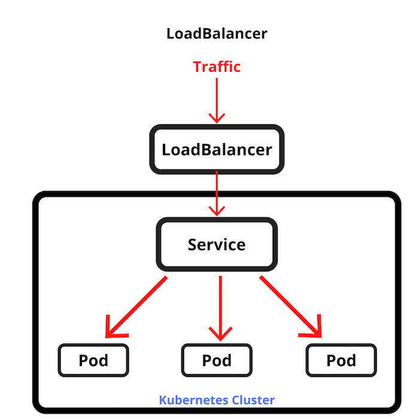

### Services

How it works: 

Create a new deployment:

`kubectl apply -f 3.services/deployment.yaml`

#### Cluster IP Service

Create the cluster ip service (which is the default type):

`kubectl apply -f 3.services/service-clusterip.yaml`

Get the ip of the newly created service:

`kubectl get svc`

In a separate terminal, get a shell inside the cluster and lets contact the above web app via the service:

`kubectl run -it alpine-svc --image=alpine:3.21 -- /bin/sh`

    Inside the pod shell, the following commands

    apk add curl

    curl http://<svc-ip>:3001

    curl http://<pod-ip>:3000/callforpapers

    curl http://go-api-demo-clusterip:3001/callforpapers

    curl http://go-api-demo-clusterip.liviu-costea:3001/callforpapers

#### Load Balancer Service

Create the LoadBalancer service:

`kubectl apply -f 3.services/service-lb.yaml`

Wait for the .status.loadBalancer to show when it is ready:

`kubectl get svc go-api-demo-lb -o yaml`

Now we can check the load balancer in our azure portal

Once we delete the service, the load balancer is also deleted:

`kubectl delete svc go-api-demo-lb`

We can see the events generated by all our actions, to see what happened to the Load Balancer:

`kubectl get events --sort-by=.metadata.creationTimestamp`
